# 2019-C论文1研读笔记  

## 摘要  

pass

## 一、问题重述  

&emsp;&emsp;比对原文发现实际上就是在题目的基础上进行一些简化以及更换主语。  
&emsp;&emsp;读题时注意一个坑就是出租车不是机场专用，只是恰好到了机场，B选择下出租车不是一定要送客到机场

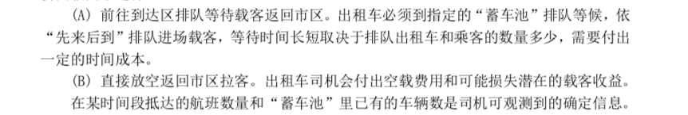
  

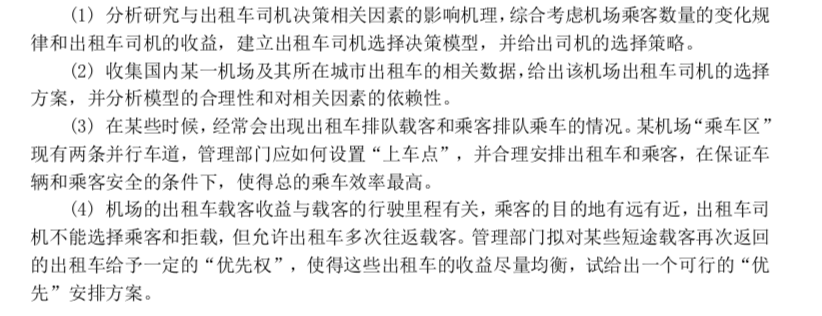
  

## 二、问题分析  

>4个小节实际上就是对应了4个问题

### 2.1 出租车司机的决策选择  

&emsp;&emsp;阐述了其他人对于类似问题的一些研究，然后说这些人的研究并没有什么卵用。。。  
&emsp;&emsp;选择影响出租车司机决策的相关因素，值得关注的两大因素：***机场乘客数量的变化***、***出租车司机的收益***。建立收益模型衡量出租车司机在相同时间内不同选择下的盈利情况，根据收益构建选择决策模型，给出司机的选择策略。

### 2.2 针对具体机场的出租车司机的选择方案  

&emsp;&emsp;收集数据，确定目标机场。整理数据，应用建立的选择模型给出出租车司机的选择方案。

### 2.3 合理安排上车点  

&emsp;&emsp;又是其他人对类似问题的研究在这里没有什么卵用。。。  
&emsp;&emsp;首先以车辆和乘客安全性为条件挑选出一种上客布局形式，研究在固定时间内上客区出租车完成上客的概率，以每小时出租车的驶离量为目标函数建立目标优化模型，给出该种上客布局形式的合理的乘车点数量。

### 2.4 有“优先权”的出租车安排  

&emsp;&emsp;浦东国际机场的案例：出租车如果上次从机场出发搭载的乘客路程较近，就可以花更少的排队时间接到新的乘客，从而使司机的收益尽量均衡。建立收益平衡方程式，可以得到短途载客再次返回机场理论上应该排的位置。

本题思路框图

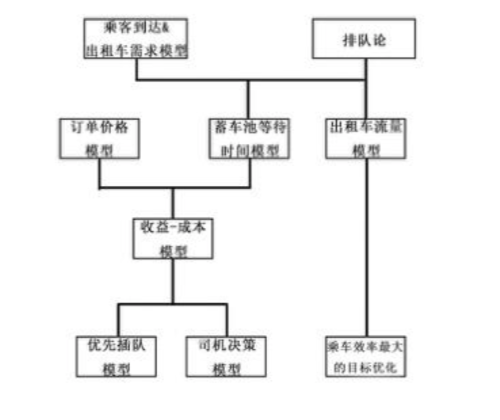
  

## 三、基本假设  

1、每公里耗油量为定值。  
2、单位时间内因器件损耗造成的其他成本为定值。  
3、不计乘客因上不同车道上的车而造成的微小时间差。  
4、收集的求解需要的数据真实准确可信。  

## 四、变量说明  

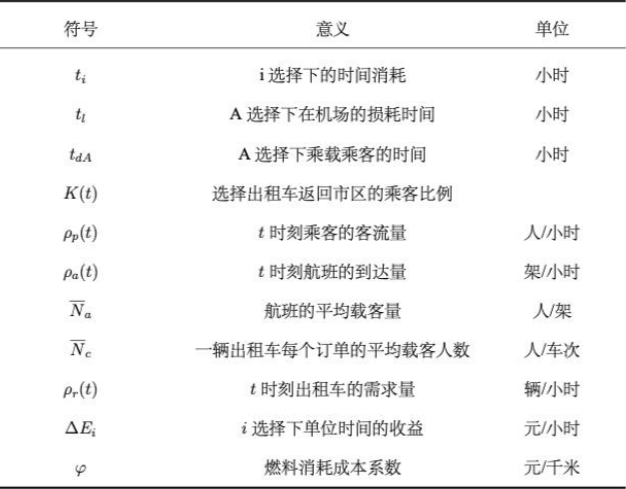
  

|符号             |意义                      |单位  |
|:---------------|:------------------------|:-----|
|$t_i$           |i选择下的时间消耗           |小时  |
|$t_l$           |A选择下在机场的损耗时间      |小时  |
|$t_{dA}$        |A选择下乘载乘客的时间        |小时  |
|$K(t)$          |选择出租车返回市区的乘客比例  |      |
|$\rho_p(t)$     |t时刻乘客的客流量           |人/小时|
|$\rho_a(t)$     |t时刻航班的到达量           |架/小时|
|$\overline{N}_a$|航班的平均载客量            |人/架  |
|$\overline{N}_c$|一辆出租车每个订单的平均载客数|人/车次 |
|$\rho_r(t)$     |t时刻出租车的需求量         |辆/小时 |
|$\Delta E_i$    |i选择下单位时间的收益       |元/小时 |
|$\phi$          |燃料消耗成本系数            |元/千米 |

## 五、模型的建立与求解  

### 5.1 出租车司机选择决策模型  

+ 对于前往到达区排队等待载客返回市区以及直接返回市区两种不同选择，综合考虑其时间成本以及收益，以***单位时间收益***为依据为司机作出选择策略。  
+ 对与排队载客返回市区，利用排队论的知识衡量出租车的等待时间。  

#### 5.1.1 影响出租车司机决策的相关因素  

+ 排队时间：乘客选择出租车的数量和比例与***天气、时间、航班的抵达量***有关
+ 返程时间：订单距离机场距离
+ 收入与成本：司机决策的重要因素，司机做决策时总是会从***单位时间***的收益考虑
  

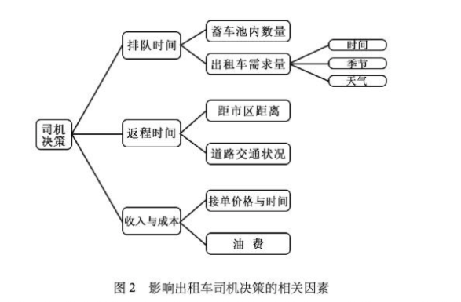
  

#### 5.1.2 两种不同选择下的时间消耗构成（$t_i$)  

>A：前往到达区排队等待载客返回市区，B：直接放空返回市区  

以一次A行为完成的时间为基准，研究B行为的时间消耗构成(***可能重复多次***)

---
A:  

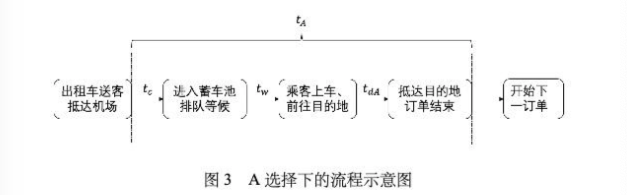
  

$t_c$: 从送客车道到蓄车池  
$t_w$: 在蓄车池排队等待时间  
$t_l$: 在机场的损耗时间 = 从送客车道到蓄车池 + 在蓄车池排队等待时间  
$t_{dA}$: 开车前往乘客的目的地  
  
$t_A = t_c + t_w + t_{dA}$  
记: $t_l = t_c + t_w$  
$t_A = t_c + t_w + t_{dA} = t_l + t_{dA}$  

---
B:  

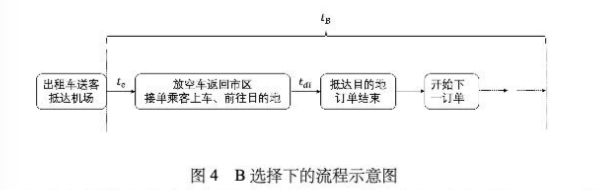
  

$t_e$: 从送客车道返回市区搜寻乘客  
$t_{di}$: 从第i个乘客上车到下一个乘客上车的时间  
  
$t_B = t_e + \sum_1^n t_{di}$  
n为相等时间内B选择下出租车司机的接单数量  

#### 5.1.3 出租车需求($\rho_r(t)$)模型  

>夜间选择出租车的乘客较多，雨雪天选择出租车的乘客较多  
>白天航班较多，恶劣天气航班较少  
  
$\rho_c(t)$: 出租车乘客数量  
$K(t)$: 选择出租车返回市区的乘客比例  
$\rho_p(t)$: 乘客的客流量  
计算公式1: $\rho_c(t) = K(t) * \rho_p(t)$  
即: 出租车乘客数量 = 选择出租车返回市区的乘客比例 * 乘客的客流量  
  
$\rho_p(t)$: 乘客的客流量  
$\rho_a(t)$: 航班的到达量
$\overline{N}_a$: 航班的平均载客量
计算公式2: $\rho_p(t) = \rho_a(t) * \overline{N}_a$  
即: 乘客的客流量 = 航班的到达量 * 航班的平均载客量  
  
$\overline{N}_a$: 航班的平均载客量  
$N_p$: 某段时间内乘客的抵达数量  
$N_a$: 航班的抵达数量  
计算公式3: $\overline{N}_a = {N_p\over N_a}$  
即: 航班的平均载客量 = 某段时间内乘客的抵达数 / 航班的抵达数量  
  
***$\rho_r(t)$: 出租车t时刻的需求量***  
$\rho_c(t)$: 出租车乘客数量  
$\overline{N}_c$: 一辆出租车每个订单的平均载客数  
计算公式4: $\rho_r(t) = {\rho_c(t)\over \overline{N}_c}$  
即: 出租车t时刻的需求量 = 出租车乘客数量 / 一辆出租车每个订单的平均载客数  
  
#### 5.1.4 基于生灭过程的A选择下损耗时间($t_l$)的确定  

>出租车进场规则为“先来后到”  
>引入“生灭过程”，“生”表示出租车及乘客的到达，“灭”表示乘客以及出租车的离去  
>排队系统：输入过程(空出租车及乘客)、输出过程(载客出租车)、排队规则、服务过程(出租车为移动服务台)  
>两种情况：乘客不足、乘客充足  
  
？？？？？论文中存在一些问题，而且可能涉及到了排队论到知识，没有看懂。  
基本相关的概念:  
$S_1$: 乘客不足时出租车在蓄车池内数量  
$S_2$: 乘客充足时蓄车池内出租车数量  
$\rho_r(t)$: 乘客不足时出租车t时刻的需求量  
$\mu$: 乘客充足时单位时间出租车的驶出辆  
  
$t_l$ 与 $S_1\over \rho_r(t)$ 和 $S_2\over \mu$ 有关  

>阅读笔记：这段可能本身就有问题，后面也没有用过  

#### 5.1.5 两种不同选择下单位时间的收益($\Delta E_i$)  

>收益 = 收入 - 成本  

$\phi$: 燃料消耗成本系数  
$a$: 出租车每百公里燃料消耗数  
$P_o$: 每升燃料的价格  
计算公式: $\phi = {a P_o\over 100}$  

---
A:  
$C_A$: A选择下的成本  
$X_A$: 总行程距离  
$C'$: 除燃料消耗成本的其他成本  
计算公式: $C_A = \phi X_A + C'$  
  
$E_A$: A选择下的收益  
$P_A$: 订单的价格(与地方出租车的价格管理有关)  
计算公式: $E_A = P_A - C_A$  
  
***$\Delta E_A$: A选择下单位时间的收益***  
计算公式: $\Delta E_A = {E_A\over t_A}$  

---
B:(相同时间内接单数量可能不止一单)  
$C_B$: B选择下的成本  
$X_i$: 一个订单开始到下一个订单开始所行驶的路程  
$C'$: 除燃料消耗成本的其他成本  
计算公式: $C_B = \phi \sum_0^n X_i + C'$  

$E_B$: B选择下的收益  
$P_i$: 第i个订单的价格  
计算公式: $E_B = \sum_1^n P_i - C_B$  
  
***$\Delta E_B$: B选择下单位时间的收益***  
计算公式: $\Delta E_B = {E_B\over t_B}$  

#### 5.1.6 基于收益的出租车司机选择决策模型的建立  

$sgn(\Delta E_A - \Delta E_B)$  
取值为1时，选择方案A  
取值为-1时，选择方案B  

### 5.2 上海浦东国际机场出租车司机的选择方案  

#### 5.2.1 数据收集及计算  

+ 机场距离市中心约55km  
+ 出租车日均发车量在9100辆左右  
+ 出租车排队系统的组成: P7蓄车场、P1缓冲区、P2缓冲区
  
  
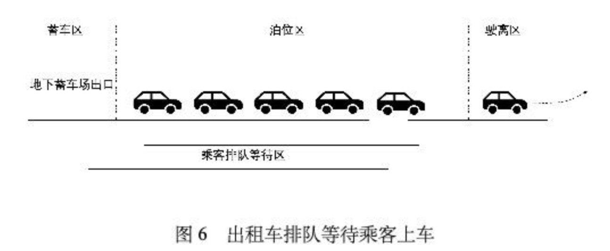
  

+ 上海浦东国际机场及城市出租车相关数据
  + $\phi = {a P_o\over 100}$计算出$\phi$(5.1.5)  
  + $\overline{N}_a = {N_p\over N_a}$计算出$\overline{N}_a$(5.1.3)  
  + 百度地图核算得到$\overline{t}_{dA}$、$\overline{X}_A$、$\overline{t}_e$、$\overline{X}_0$(应该是对应了前面的$t_{dA}$、$X_A$、$t_e$，$\overline{X}_0$为B选择下返回市区拉到乘客的平均距离，前面未提及)(5.1.2 5.1.5)
  + 出租车计价规划得到$\overline{P}_A$和$\overline{X}_i$(5.1.5)

  
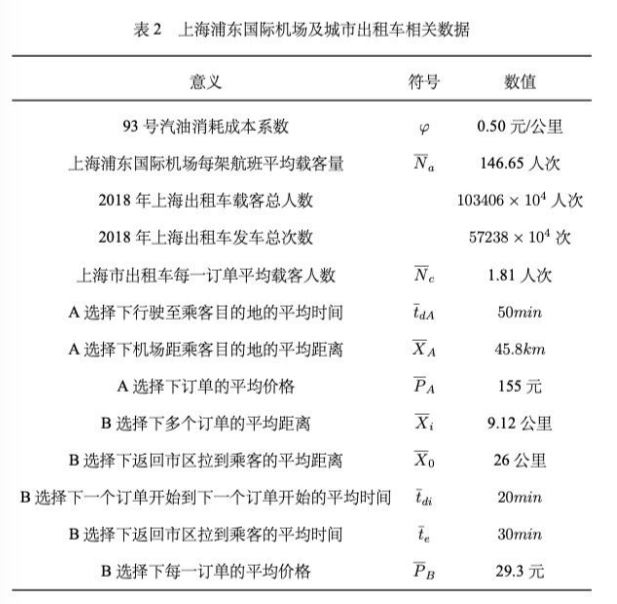
  

+ 乘客抵达量和出租车需求量随时间到变化  
  + (a): 客流量在1点、11点、16点、20点高峰期
  + (b): 出租车需求量在2点、12点、17点、20点半高峰期
  
  
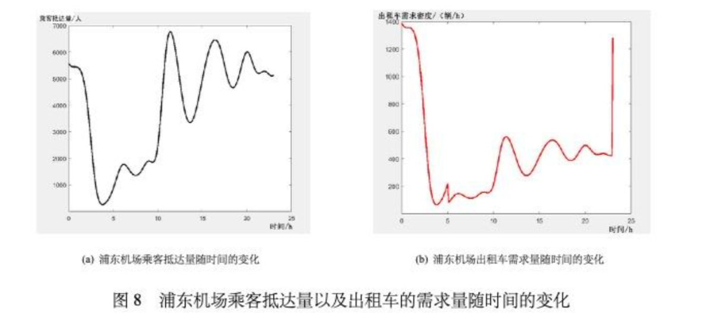
  

#### 5.2.2 平衡状态下出租车的队列长度  

计算在相同时间段A与B收益相同时的浦东机场出租车乘车点出租车队列长度  
即：由$t_A = t_B$ 和 $\Delta E_A = \Delta E_B$ 解出A选择下的损耗时间$t_l$  
  
$N_b(t)$是在t之后$t_l$(确定的理想值)的时间内所需要的车辆(***理想队列长度***)  
$\rho_r(t)$为t时刻出租车的需求量(5.1.3)  
出租车乘车点理想队列长度为: $N_b(t) = \int_t^{t+t_l} \rho_r(t) dt$(此时两种方法收益相等)  
  
$N_p(t)$是在t之前当前已经排了多少的车辆(***实际队列长度***)  
$\rho_m(t)$为t时刻将乘客送往机场到达出发通道的出租车数量(由航班数和航班平均载客量得到)  
$N_0$为出租车队列的初始长度(定为600)  
出租车乘车点实际队列长度为: $N_p(t) = \int_0^t (\rho_m(t)-\rho_r(t)) dt + N_0$  
  
平衡状态下$N_p(t) = N_b(t)$，两种选择收益相等  
某时刻$N_p(t) > N_b(t)$，B方案收益更大  
某时刻$N_p(t) < N_b(t)$，A方案收益更大  

#### 5.2.3 出租车司机的选择方案  

1. 由$t_A = t_B$ 和 $\Delta E_A = \Delta E_B$列出线性方程组  
2. 由矩阵变换得出线性方程组的解，即损耗时间$t_l$的值  
3. 由梯形积分法求解出收益相等时理想队列长度$N_b(t)$和实际队列长度$N_p(t)$  

求解图像:

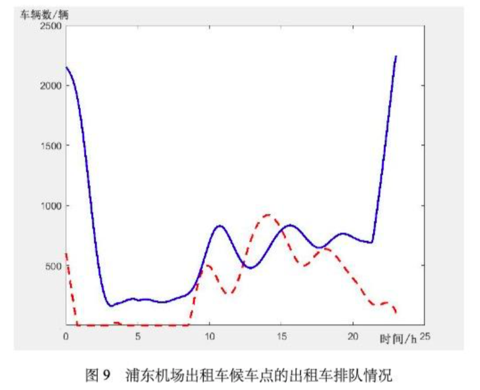
  

蓝线代表A选择与B选择收益相等时出租车的队列长度，红线代表实际出租车队列长度  
12:24-15:00，红线值高于蓝线值，供大于求  
其他时刻，红线低于蓝线，供小于求  
  
建议方案：在12:24-15:00直接放空返回市区，其他时刻前往到达区  

#### 5.2.4出租车选择决策模型对相关因素的依赖性  

>改变量：每架航班的平均载客量、市区内一个订单的平均时间、A选择下的订单平均价格、B选择下每一订单的平均价格以及油耗成本系数，观察选择B的时间长度的改变  

1. 每架航班的平均载客量的改变对决策结果的影响  

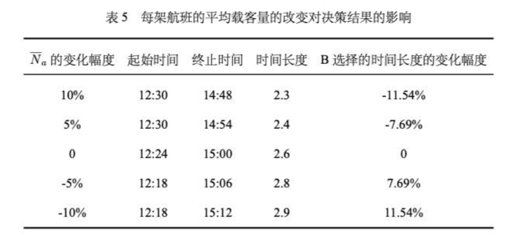
  

当$\overline{N}_a$增加时，选择乘出租车去市区或周边的乘客数量增加，对出租车的需求量增加，出租车选择A的收益更大，因此选择B的时间长度变短  
  
2. 市区内一个订单的平均时间的改变对决策结果的影响  

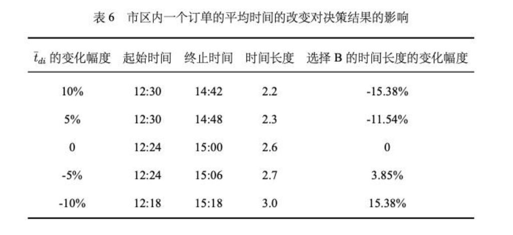
  

当$\overline{t}_{di}$增加时，相等时间内B的接单量减少，收益相对减少，选择B的时间长度变短  

>阅读笔记：这里没有考虑价格和时间的关系，是不完备的  
  
3. A选择下订单的平均价格的改变对决策结果的影响  

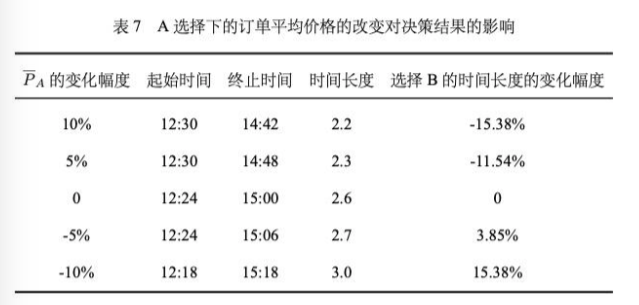
  

当$\overline{P}_A$增加时，相等时间内A的收益增加，选择B的时间长度变短  
  
4. B选择下每一订单的平均价格的改变对决策结果的影响  

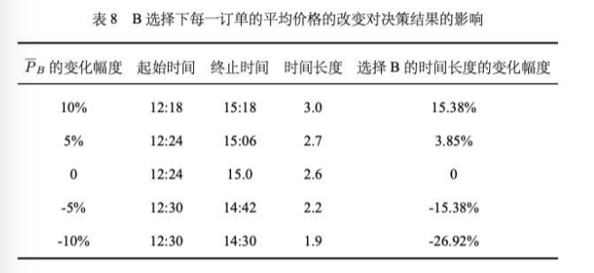
  

当$\overline{P}_B$增加时，选择B的收益更大，选择B的时间增加  
特别的，每一订单平均价格的减少比平均价格的增加影响选择B的时间长度更大  
  
5. 油耗成本系数的改变对决策结果的影响  

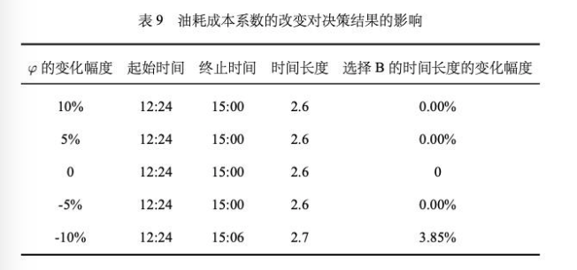
  

油耗成本系数的变化对出租车司机的决策方案影响不大  
油耗成本系数减少10%时，选择B的时间长度增加  

>结论：出租车司机选择决策模型受到市区内每一订单的平均价格影响较大，而油耗成本影响较小。也就是说模型对于市区内每一订单的平均价格依赖性较高。  

#### 5.2.5 出租车选择决策模型的合理性  

对浦东机场每时刻的航班到达量进行了加高斯噪声处理(均值0，方差$\sigma$的正态分布)，观察给出的决策方案中选择B时段长度的变化。  

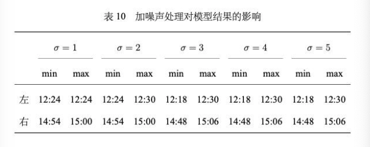
  

则可以得出模型的准确率88.46%  

>阅读笔记：这里的处理实际上就是航班到达量对于选择B的时间长度的影响，还是纯理论的分析，并没有(事实上也很难)结合实际情况判断准确率(因为数据远远不够)。  

### 5.3 乘车区的设计  

#### 5.3.1 上车点的设置  

主要布局形式：  

+ 单车道出租车上客方式  
  
  
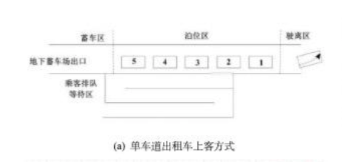
  

  无法保证出租车的发车效率  

+ 多车道出租车上客方式  
  
  
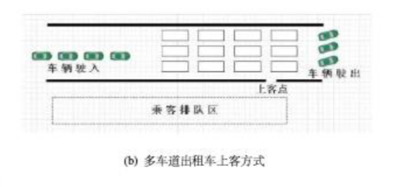
  

  一次满足多辆出租车停靠，方便乘客搬运行李，一定程度避免人车混行状况  

+ 斜列式出租车上课方式  

  
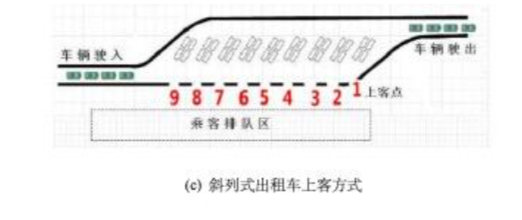
  

  有效提高乘车效率，降低驶离车辆间的干扰  

+ 混合式出租车上课方式  

  
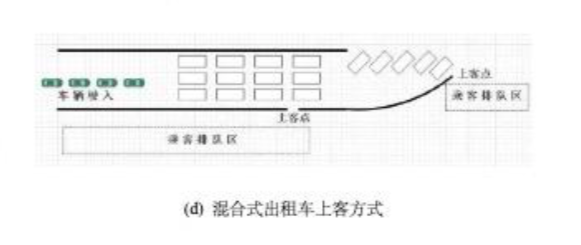
  

  多车道和斜列式的结合，一次发车量大，发车效率较低  

>研究双车道出租车上客方式，求出乘车效率最高时乘车点的设置情况。  

#### 5.3.2 乘车效率模型的建立  

***设一共有n个泊车位***

这里的简化假设是:

1. 双车道每个车道泊车位相等，等距对称分布  
2. 不是动态过程而是一个周期：一批出租车进入蓄车池、乘客上车、这一批出租车离开蓄车池  
3. 每辆车乘客上车的时间服从$\lambda$的指数分布

>阅读笔记：文中好像忘记给出$\lambda$了  

单辆车在t秒内完成上车的概率为: $P_1 = 1 - e^{-\lambda t}$  
上车区所有车在t秒内完成上车的概率的分布函数: $P_n = (1 - e^{-\lambda t})^n$  
上车区所有车在t秒内完成上车的概率的概率密度函数: ${dP_n\over dt} = \lambda e^{-\lambda t} n (1 - e^{-\lambda t})^{n-1}$  
***乘客上车时间的期望:*** $E = \int_0^\infty \lambda e^{-\lambda t} n (1 - e^{-\lambda t})^{n-1} t dt$  

设一个停车位的长度为L(5m)，车道限速为v(5km/h)，每一位司机启动车的反应时间$t_r$(1s)  
有: $t_{in} = t_{out} = {nL\over v} + (n-1)t_r$  

设上车区车道的数量为k(2)  
***一个周期出租车的时间:***  
$t_{per} = E + t_{in} + t_{out} = \int_0^\infty \lambda e^{-\lambda t} n (1 - e^{-\lambda t})^{n-1} t dt + {2\over k}[{nL\over v} + (n-1)t_r]$  

建立以每小时驶离上客区的出租车数量为目标函数的目标优化模型:  
$\exists n, s.t. max({n\over t_{per}})$  

#### 5.3.3 乘车效率模型的求解  

采用蒙特卡洛(大概就是一个逐渐逼近最优的过程)来确定上车点数的最优解

+ Step 1.初值n = 2  
+ Step 2.若n < 100，获得n个服从参数为$\lambda$的指数分布的随机数(就是对应的n辆车乘客上车花费的时间数)；若n > 100，转Step 7  
+ Step 3.令E为n个随机数的最大值(就是花费时间最长的为该批次乘客上车花费时间)，计算$t_per(i)$  
+ Step 4.重复Step2-Step3共100次，存储每次$t_{per}$为$t_{per}(i)$  
+ Step 5.$t_{per}$为100次的平均值$mean(t_{per}(i))$  
+ Step 6.计算目标函数值，然后n += 2，转Step2  
+ Step 7.计算目标函数最大值时的n  

>阅读笔记：注意这里极具误导性。这个求解并没有使用5.3.2中得到的E的公式，而是通过生成随机数来直接计算E的值  

得到 泊位数-出租车供给能力 图像:  

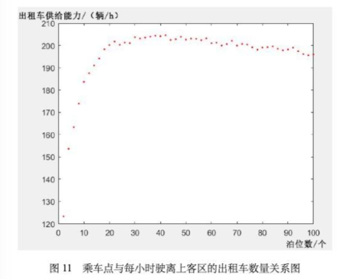
  

上客区车道长度有限，考虑管理和安全问题，以每小时驶离上客区的出租车数量最大值的0.9倍进行搜寻得到此时泊位数为10，2条车道每条车道泊位数为5  

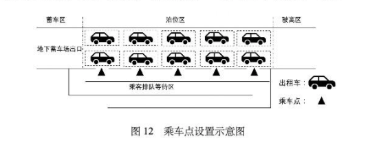
  

### 5.4 出租车优先插队模型  

#### 5.4.1 出租车优先插队模型的建立  

>给予某些短途载客再次返回的出租车一定的优先权，减少排队的时间  

+ 长途载客出租车:  
  返回市区后持续在市区拉客(一直在市区)  
  $t_{dj}$: 出租车返回市区后从上一单结束到下一单开始的时间  
  $m$: 出租车返回市区后接单的数量  
  $P_{hj}$: 出租车返回市区拉客每一单的价格  
  $X_{hj}$: 出租车返回市区从上一单结束到下一单开始的行车距离  
  总时间: $t_h = t_l + t_{dA} + \sum_{j=1}^m t_{dj}$  
  总收益: $E_h = P_A + \sum_{j=1}^m P_{hj} - \phi X_A - \phi \sum_{j=1}^m X_{hj} - C'$  

+ 短途载客出租车:  
  返回市区后再回到机场然后在机场再完成一个长途订单(最后回到市区)  
  短途订单的距离为长途订单距离的$\gamma$倍，行程时间也是长途订单的$\gamma$倍  
  ***$t_l'$: 出租车返回机场后接到下一单的等待时间***  
  $t_{dA}'$: 出租车返回机场后完成下一订单花费时间  
  $P_A'$: 出租车返回机场后下一订单的价格  
  总时间: $t_s = t_l + 2\gamma t_{dA} + t_l' + t_{dA}'$  
  总收益: $E_s = P_A + P_A' - (1 + 2 \gamma) \phi X_A - C'$  

平衡方程: $t_h = t_s$, $E_h = E_s$  
可以解出$t_l'$，由$t_l'$可以得到短途载客出租车再次返回时应该排队的位置$N_{cut}(t)$(前面排队的出租车数量)  
  
***插队模型: $N_{cut}(t) = \int_t^{t+t_l'} \rho_r(t) dt$***  

>阅读笔记：这个问题应该是比较短途载客出租车选择返回和选择在市区拉客之间的关系，但是模型建立的是长途载客出租车在市区拉客和短途载客出租车返回机场的关系。并且还假设短途载客出租车返回机场会接到长途订单。这个模型不太合理，主要问题在于没有将订单价格作为距离的函数。  

#### 5.4.2 出租车优先插队模型的求解  

规定短途为不超过20km的行程，$\gamma$分别取0.2和0.4  

+ step 1.列出$t_h = t_s$, $E_h = E_s$ 线性方程组  
+ step 2.矩阵变换解出$t_l'$  
+ step 3.梯形积分法求出排队位置的队列长度(队列前面车辆) $N_b(t)$  

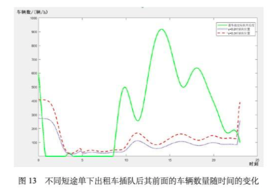
  

绿线代表蓄车池内的实际出租车排队的队列长度(浦东机场9月13日)  
蓝线代表$\gamma$取0.2时短途订单出租车插队后其前面的车辆数  
红线代表$\gamma$取0.4时短途订单出租车插队后其前面的车辆数  
  
红线在蓝线之上，代表随短途订单距离增加，收益增加，则插队时前面的出租车数也在增加  
在0:30-3:00，蓄车池内出租车供小于求，司机返回即可接下一单  

在一些具体时刻短途出租车返回机场的插队情况  

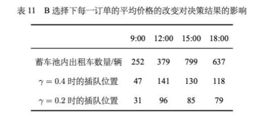
  

>阅读笔记：由于不可能随时在任何位置插入，应该要考虑的是在什么位置设置插入点比较合适，而论文中没有这一点  

## 六、模型的检验  

通过改变$\lambda$、$L$和$v$的值来观察问题三中乘车效率和乘车点的变化  

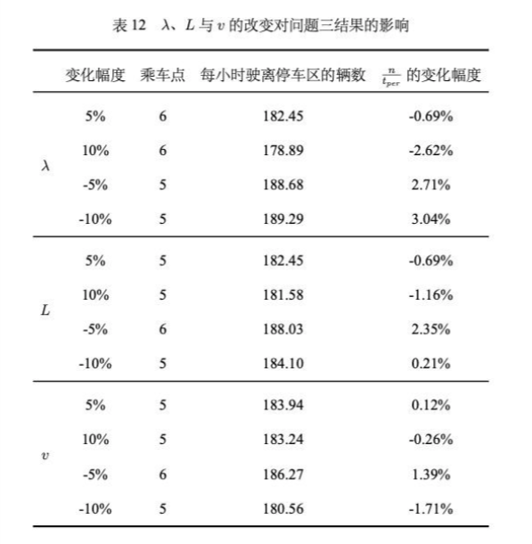
  

>阅读笔记：和 5.2.5 中提出的一样，只是纯粹的理论检验，没有实际的检验  

## 七、模型的评价

(读者瞎扯)  
模型的优点：感谢大佬，像本人这种菜鸡能够大部分看懂  
模型的缺点：似乎很多很多的样子，具体看文中的 ***“阅读笔记”***  
模型的改进：很重要的一点，时间和价格应该与距离挂钩(即使是一次函数模型都会好很多)  
模型的推广：又是生灭过程？前面的那一段能不能改的可读一些？  

## 参考文献

能在比赛这么短时间内读这么多参考资料太厉害了(虽然感觉没怎么用)  

## 代码源程序

看不懂matlab程序，假设都是对的  
