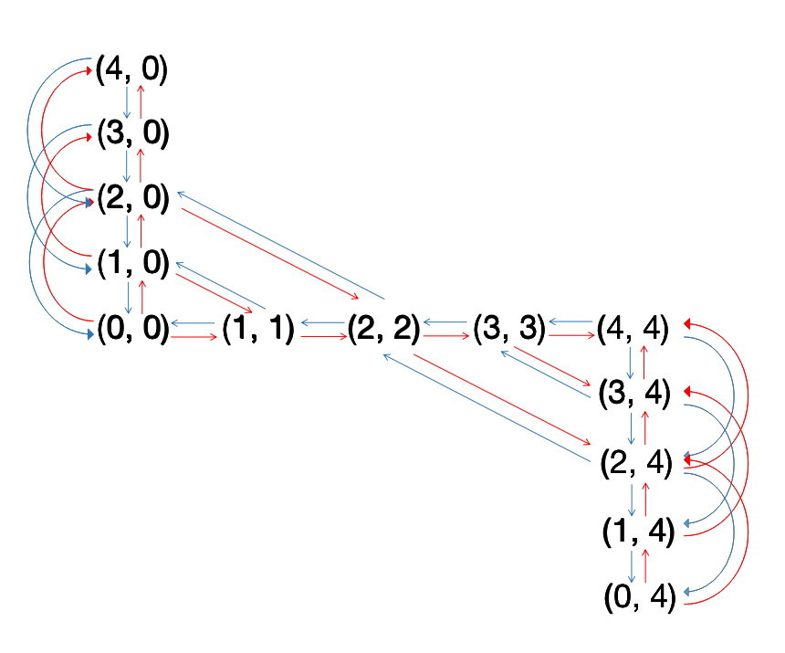
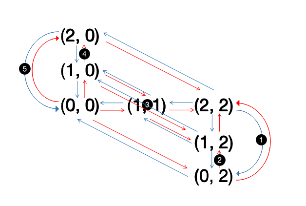
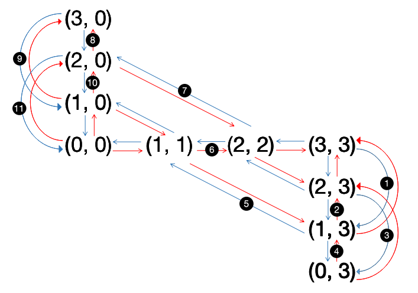
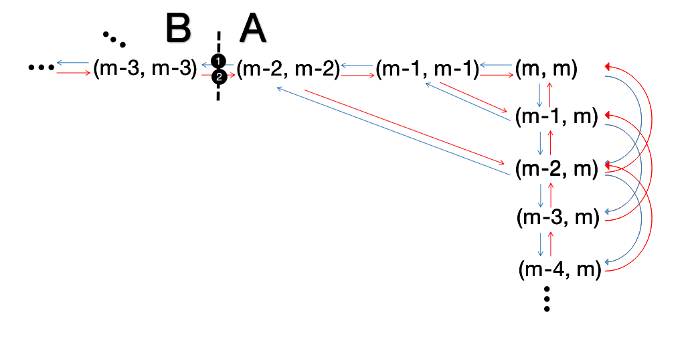

# 论文草稿

定义：状态$(r, b)$表示没有人在船上时，原来岸边有$r$个随从，$b$个商人。

引理：合法状态$(r, b)$当且仅当$r = b$ 或$b = 0$或$b = m$  
>引理证明：  
>必要性：  
>当$r = b$时，商人不会被杀。  
>当$b = 0$或$b = m$时，一边岸上商人数为0，另一边为m，随从数小于等于m，因此商人不会被杀。  
>充分性：  
>假设在状态$(r_0, b_0)$下商人不会被杀，且此时$r_0\neq b_0$，$b_0\neq 0$，$b_0\neq m$。  
>若$r_0 < b_0$，则在另一边$m-r_0 > m-b_0$且$m-b_0\neq 0$因此商人会被杀。$r_0 > b_0$同理。

状态转移方程：  
对于过河的情况，$(r, b)$可以到达$(r-1, b), (r-2, b), (r, b-1), (r, b-2), (r-1, b-1)$  
对于返回的情况，$(r, b)$可以到达$(r+1, b), (r+2, b), (r, b+1), (r, b+2), (r+1, b+1)$

将所有合法的状态视为点  
如果在过河方向可以从X到达Y，则在A和B之间连一条蓝线  
如果在返回方向可以从X到达Y，则在A和B之间连一条红线  
可以得到一个双色有向图  

因此题目转换为：  
是否存在一条路径，每次交替经过红色和蓝色的边，从$(m, m)$到达$(0, 0)$？

## 第一问

第一问考虑m = 4的情况，m = 4的图像如图所示



从左上角到右下角的点分别赋值为0，1，...，12，可以使用以下程序使用广度优先搜索证明无解

```
#include <iostream>
#include <vector>
#include <utility>
#include <queue>
#define pii pair<int, int>
using namespace std;

struct Node
{
    int id; int r, b;
}nodes[13];

struct Edge
{
    int u, v; int col;
}edges[44];

vector<int> G[13];

void build(int u, int v, int i)
{
    edges[2*i] = Edge{u, v, 0}; G[u].push_back(2*i);
    edges[2*i+1] = Edge{v, u, 1}; G[v].push_back(2*i+1);
}

bool bfs()
{
    int vis[13][2] = {0};   // 在col状态下是否已经到达过点i
    queue<pii> q;
    q.push(make_pair(8, 1));
    vis[8][1] = 1;
    while(!q.empty())
    {
        pii p = q.front(); q.pop();
        int u = p.first, col = p.second;
        for(int i = 0; i < G[u].size(); i++)
        {
            Edge e = edges[G[u][i]];
            if(e.col == col || vis[e.v][e.col]) continue;
            if(e.v == 4) return true;
            vis[e.v][e.col] = 1;
            q.push(make_pair(e.v, e.col));
        }
    }
    return false;
}

int main()
{
    for(int i = 0; i < 5; i++)
        nodes[i] = Node{i, 4-i, 0};
    for(int i = 5; i < 8; i++)
        nodes[i] = Node{i, i-4, i-4};
    for(int i = 8; i < 13; i++)
        nodes[i] = Node{i, 12-i, 4};

    build(0, 1, 0); build(0, 2, 1);
    build(1, 2, 2); build(1, 3, 3);
    build(2, 3, 4); build(2, 4, 5);
    build(3, 4, 6); build(5, 4, 7);
    build(5, 3, 8); build(6, 5, 9);
    build(6, 2, 10); build(7, 6, 11);
    build(8, 7, 12); build(8, 9, 13);
    build(8, 10, 14); build(9, 10, 15);
    build(9, 7, 16); build(9, 11, 17);
    build(10, 11, 18); build(10, 12,19);
    build(10, 6, 20); build(11, 12, 21);

    if(bfs()) cout << "Yes" << endl;
    else cout << "No" << endl;
    return 0;
}
```

最后结果输出"No"，证明该图中不存在这样的一条路径。因此4个人的时候不存在一个这样的方案。

## 第二问

我们给出m=1, 2, 3时方案的构造，并且证明m >= 4时不存在这样的方案

### m = 1

只需要两个人一起过河即可

### m = 2



(这里需要回到原题解释每一个步骤与序号对应)  
~~(其实主要是凑字数)~~

### m = 3



(同m=2的说明)  
~~(这个可以凑更多的字数)~~

### m >= 4

m = 4的情况由第一问的结论，方案是不存在的

下面证明m >= 5时方案不存在：



>证明：  
$(r, m)$无法与$(r, b)$连接，其中$b < m-2$  
$(r, 0)$无法与$(r, b)$连接，其中$b > 2$  
$(x, x)$无法与$(x+k, x+k)$连接，其中$|k| > 1$  
因此如果去掉边①，②，整个图将被分为两个不连通的子图A和B。要从A的点$(m, m)$到达B的$(0, 0)$，必须经过$(m-2, m-2)$点，再从边①进入子图B。但是在子图A中点$(m-2, m-2)$只有蓝色的入度，因此从A中的点进入$(m-2, m-2)$后不能进入蓝色的边①。因此无法从图A进入图B。所以不存在一条路径从$(m, m)$到$(0, 0)$且红蓝交替。  

>这里的证明如果未未的方法是可行的，就在后面加上
~~(总之凑字数)~~

## 其他问题

凑字数 凑字数 凑字数  
还有弄一点参考文献？？？？？？？反正m=4的文章好像挺多，就当不是我们自己写的  
我对m>=5的证明的完备性还是有些担心，可能需要重写过程，而且未未的方法能行是最好的
